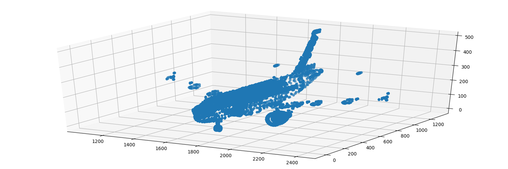
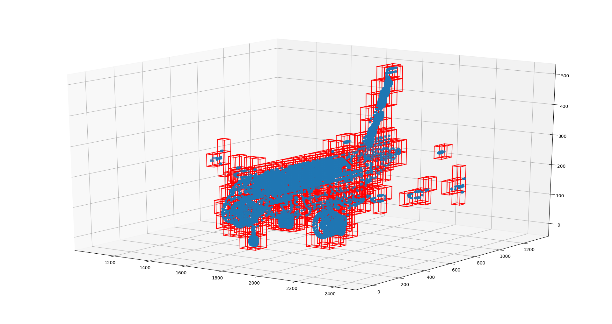

# Generic Spatial Data Structure

This library contains the implementation of spatial-partioning-related data structures and algorithms.

## Dependencies ##
- [Eigen](http://eigen.tuxfamily.org)
- [Doxygen](http://www.doxygen.nl/index.html)(for documentation only)

